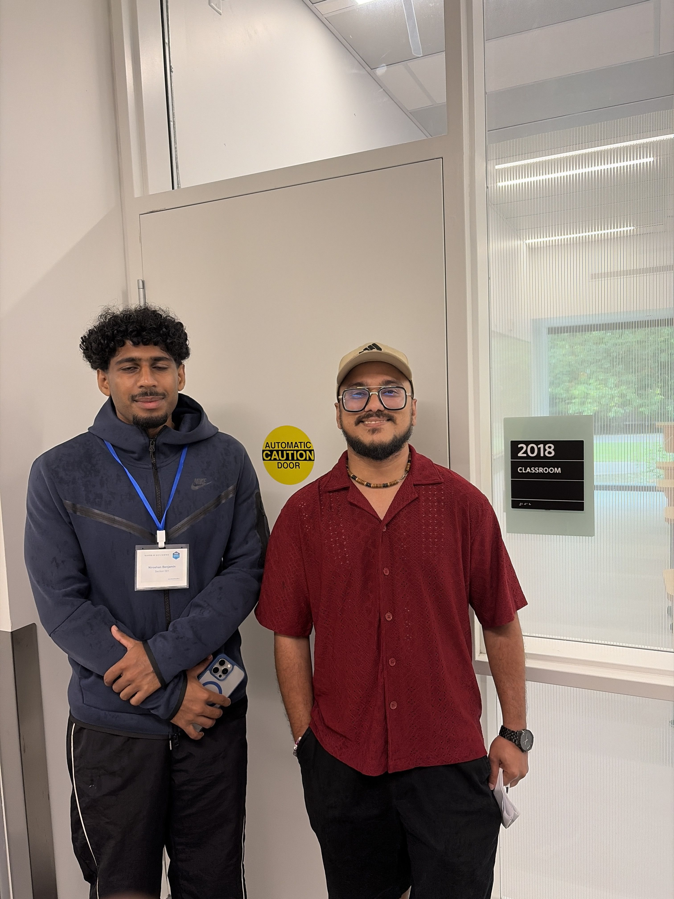

I got to Canada a month before the program started and spent it in Calgary with my wife, easing into the country before easing into the degree. We spent our anniversary glamping in Kananaskis, drove up to Banff, and I picked up paddleboarding on Bow Lake, Barrier Lake, and a handful of others whose names I've already lost. I flew into Vancouver the day before orientation, which in hindsight was cutting it close, but I'd wanted every last day of that Alberta stretch. My first impression of UBC is that I would not want to leave in ten months. I've been slowly working my way through it since, the Museum of Anthropology, Tower Beach, the Rose Garden, Nitobe, all of it quietly making the case that this was the right choice.

Orientation was the fun part. Somewhere between the icebreakers and the campus goose chase, I stopped feeling like the new guy and started feeling like part of a cohort. A lot of the pep talks were built around how to survive the program, which was a strange note to open on given that most of us were already plenty scared, but I got to meet people, had fun explaining how to pronounce my name, and run around the campus with Barry, Rshan, Yeme, Julia, and Abdul on the goose chase. There was also a running theme of warnings about how depressing Vancouver gets in winter. Jury's still out.

Then week one arrived and we were thrown straight onto the roller coaster tracks. Not even the seats, just the tracks. We've been zooming past labs and worksheets ever since. The workload is genuinely intense, but the trauma bonding it produces is more intense still, and it's been wonderful to see how many different paths and peole have crossed their paths here. I'm overwhelmed, I haven't seen the inside of a gym since I got here, and I'm trying to keep my head above water long enough to actually enjoy what I signed up for. I've got ten months to figure out what I'm doing, ace the next quiz, and build something I'm proud of. That's the plan for now.

